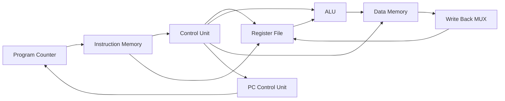
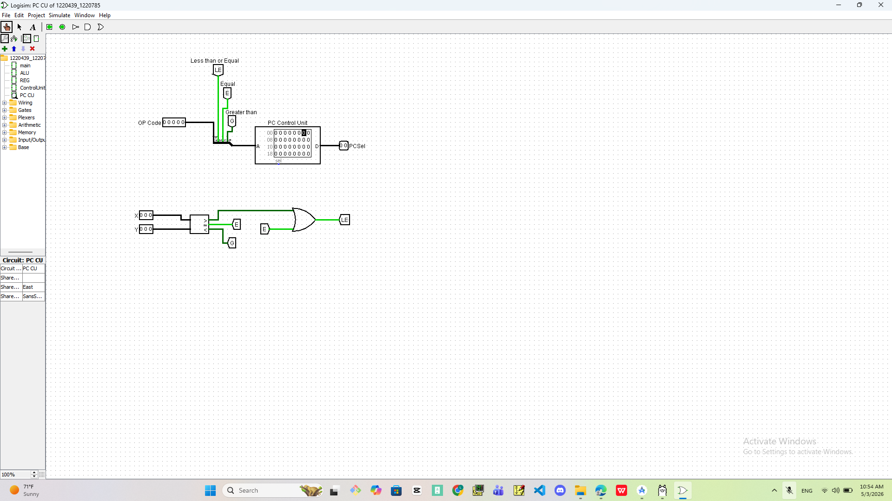

# 🧠 Custom 32-bit CPU Design in Logisim

> A complete custom 32-bit CPU designed and implemented in Logisim, featuring a full datapath, control unit, ALU, register file, memory system, and branching logic.

---

## 👩‍💻 Authors

- **Lana Sayes**
- **Tasneem Shella**

---

## 📌 Project Overview

This project presents the design and implementation of a **custom 32-bit processor** using **Logisim**.  
The main goal of the project is to understand how a processor works internally by building its main components from the logic level and connecting them together into one complete datapath.

The processor includes the main stages of instruction execution:

- Instruction Fetch
- Instruction Decode
- Register Read
- ALU Execution
- Memory Access
- Write Back
- PC Update / Branch Decision

The design is modular, which means each major part of the processor was built as a separate circuit and then connected inside the main datapath.

---

## 🏗️ High-Level CPU Architecture



The architecture shows how the processor moves from one instruction to the next.  
The **Program Counter** selects the instruction, the **Control Unit** generates control signals, the **Register File** provides operands, the **ALU** performs operations, and the result is either written back to registers or used for memory access.

---

## 🖼️ Visual Documentation

---

### 🔷 Main Datapath


This image shows the complete processor datapath.  
It includes the Program Counter, Instruction Memory, Register File, ALU, Data Memory, multiplexers, immediate extension units, and write-back path.

The datapath represents how data moves inside the CPU during instruction execution. The instruction is fetched from memory, decoded into fields, executed by the ALU, and then the result is either stored in memory or written back into the register file.

---

### 🔍 Detailed Main Datapath View


This image provides a closer view of the main datapath connections.  
It shows the internal routing between the instruction fields, control signals, multiplexers, register file, ALU inputs, memory, and write-back selection.

This view is useful for understanding how control signals affect the flow of data across the processor.

---

## ⚙️ Main Processor Components

---

### 🟣 Control Unit


The Control Unit is responsible for generating the control signals needed to execute each instruction.  
It receives the opcode and function-related fields, then produces signals that control the datapath.

Main control signals include:

| Signal | Purpose |
|---|---|
| `RegDst` | Selects the destination register |
| `RegWrite` | Enables writing into the register file |
| `ExtOp` | Controls immediate extension |
| `BSel` | Selects the second ALU operand |
| `MemWrite` | Enables writing to data memory |
| `MemRead` | Enables reading from data memory |
| `WriteBack` | Selects what value is written back |
| `ALUOp` | Selects the ALU operation |

The Control Unit works like the brain of the processor because it decides how each instruction should behave.

---

### 🔁 PC Control Unit



The PC Control Unit controls the next value of the Program Counter.  
It is responsible for normal sequential execution and branching decisions.

It uses comparison flags such as:

- Equal
- Greater than
- Less than or equal

Based on these conditions, the unit decides whether the processor should continue to the next instruction or branch to another address.

This component is important because it supports decision-making instructions, similar to `if` statements and loops in programming.

---

### 🗂️ Register File


The Register File stores temporary values used during instruction execution.  
It allows the processor to read operands and write results.

Main features:

- Multiple internal registers
- Two read outputs
- One write input
- Decoder-based register selection
- Controlled by clock and `RegWrite`

The register file provides fast access to data and is one of the most important parts of the CPU datapath.

---

### 🧮 Arithmetic Logic Unit (ALU)


The ALU performs arithmetic, logical, shifting, rotation, and comparison operations.

Supported operation types include:

- Addition
- Subtraction
- AND
- OR
- Bitwise operations
- Logical shift
- Arithmetic shift
- Rotate operations
- Comparison operations

The ALU receives two operands from the datapath and produces the final computed output based on the selected ALU operation.

---

## 🔄 Instruction Execution Flow

The processor executes instructions through the following steps:

### 1. Instruction Fetch

The Program Counter provides the address of the next instruction.  
The instruction memory outputs the instruction stored at that address.

### 2. Instruction Decode

The instruction is divided into fields such as opcode, register addresses, immediate values, and function bits.  
The Control Unit reads the opcode and generates the required control signals.

### 3. Register Read

The Register File reads the required source registers and sends their values to the datapath.

### 4. Execute

The ALU performs the required operation using register values or immediate values.

### 5. Memory Access

If the instruction requires memory access, the data memory performs read or write operations.

### 6. Write Back

The final result is selected and written back into the register file if needed.

### 7. PC Update

The PC is updated either sequentially or through branching logic.

---

## 🧩 Supported Instruction Concepts

The processor design supports multiple instruction styles:

### R-Type Instructions

Used for register-to-register operations.  
The operands come from the register file, and the result is written back into a register.

### I-Type Instructions

Used for operations involving immediate values or memory access.  
The immediate value is extended and used as part of the operation.

### Branch Instructions

Used to change the flow of execution based on comparison results.

---

## 📂 Project Structure

```bash
.
├── Images/
│   ├── Alu.png
│   ├── ControlUnit.png
│   ├── Main.png
│   ├── Main2.png
│   ├── Pc CU.png
│   └── Reg.png
│
├── 1220439_1220785.circ
├── control.txt
├── report.pdf
└── README.md
```

---

## 📄 Files Description

| File | Description |
|---|---|
| `1220439_1220785.circ` | Main Logisim circuit file containing the full CPU design |
| `control.txt` | Control-related information and control signal logic |
| `report.pdf` | Full project report and documentation |
| `Images/` | Folder containing screenshots of the processor components |
| `README.md` | GitHub documentation file |

---

## ▶️ How to Run the Project

1. Open **Logisim**.
2. Open the file `1220439_1220785.circ`.
3. Select the main circuit.
4. Enable simulation.
5. Use the clock to step through execution.
6. Observe changes in:
   - Program Counter
   - Register File
   - ALU output
   - Memory
   - Control signals

---

## 🛠️ Tools and Concepts Used

- Logisim
- Digital Logic Design
- Computer Architecture
- Datapath Design
- Control Unit Design
- ALU Design
- Register File Design
- Multiplexers
- Decoders
- Memory Units
- Clocked Circuits
- Branching Logic

---

## 💡 Key Features

- Complete CPU datapath implementation
- Modular component-based design
- Separate Control Unit and PC Control Unit
- Register File with read/write support
- ALU with multiple operation types
- Memory read/write support
- Branching decision logic
- Clear visual documentation

---

## 🎯 Learning Outcomes

Through this project, we practiced and demonstrated:

- How a CPU executes instructions internally
- How datapath and control signals work together
- How registers, ALU, memory, and PC interact
- How instruction formats affect hardware design
- How branching decisions are implemented in hardware
- How to build and debug a digital processor in Logisim

---

## 🚀 Future Improvements

Possible improvements include:

- Expanding the instruction set
- Adding more registers
- Improving the ALU operation selection
- Adding pipelining
- Supporting more complex branch instructions
- Adding hazard detection for advanced CPU behavior

---

## ⭐ Final Note

This project represents a complete educational CPU design built from digital logic components.  
It demonstrates the relationship between hardware structure and instruction execution, showing how a processor can be constructed step by step from basic logic blocks into a working datapath.
