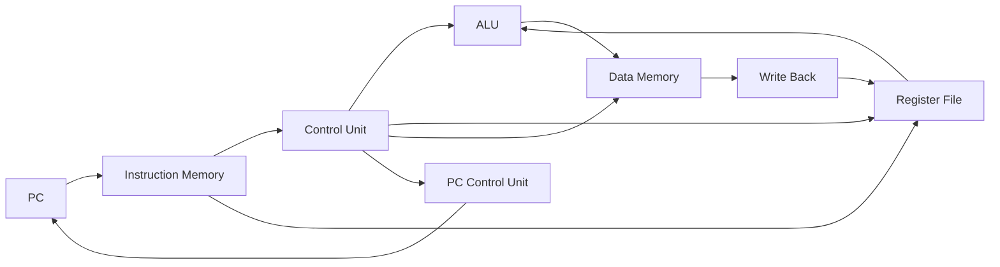
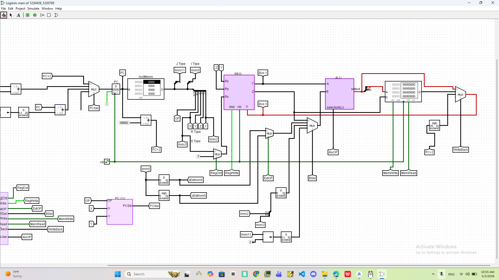
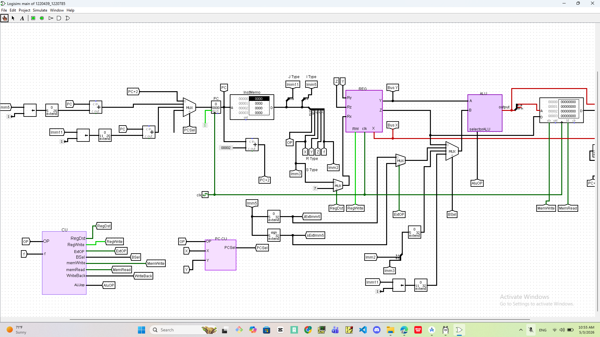
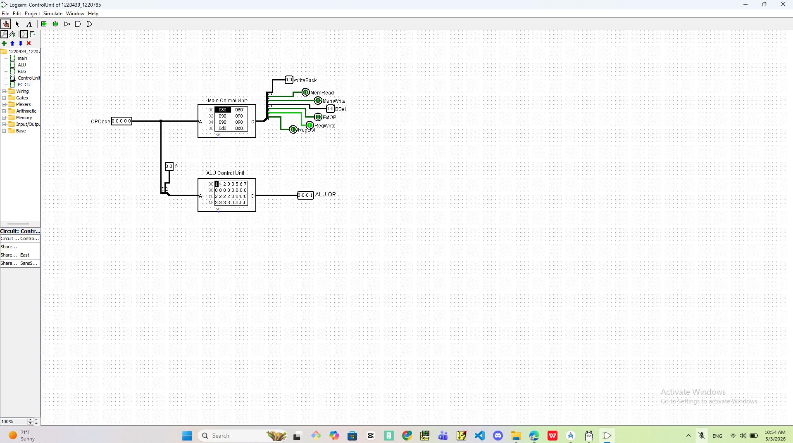
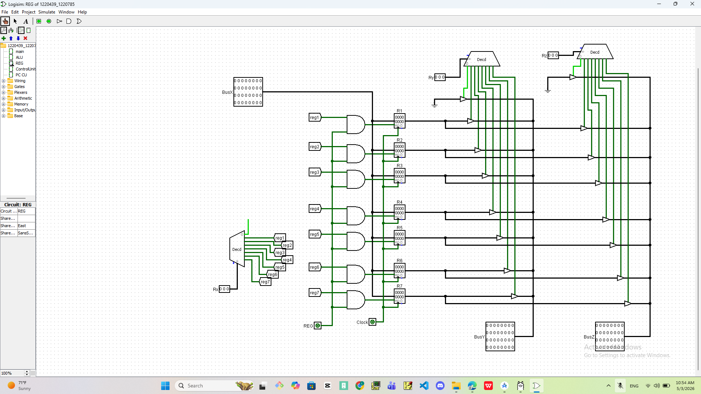
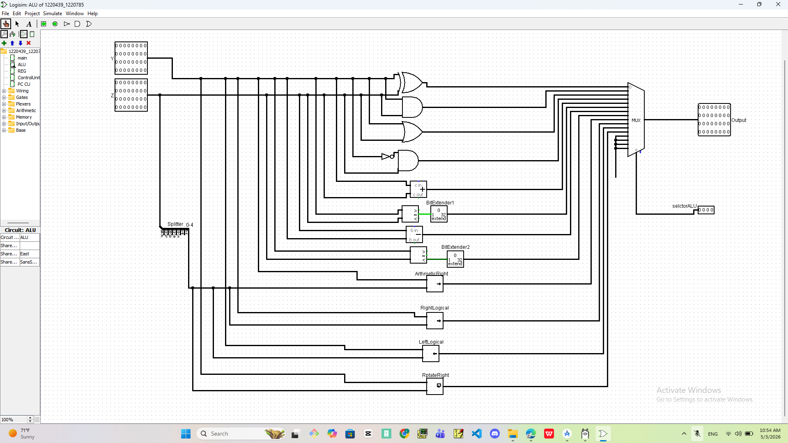

# 🧠 Custom 32-bit CPU Design in Logisim

> A complete custom 32-bit CPU designed and implemented in Logisim, featuring a full datapath, control unit, ALU, register file, memory system, and branching logic.

---

## 👩‍💻 Authors

- **Lana Sayes**
- **Tasneem Shella**

---

## 📌 Project Overview

This project presents the design and implementation of a **custom 32-bit processor** using **Logisim**.  
The processor simulates how real CPUs execute instructions through datapath and control logic.

The system includes:

- Instruction Fetch  
- Instruction Decode  
- Register Read  
- ALU Execution  
- Memory Access  
- Write Back  
- Branching Logic  

---

## 🏗️ High-Level Architecture



---

## 🖼️ System Visualization

### 🔷 Main Datapath


This image shows the full datapath including PC, instruction memory, register file, ALU, and memory.

---

### 🔍 Detailed Datapath


Shows internal connections, multiplexers, and control signal flow.

---

## ⚙️ Core Components

### 🟣 Control Unit


Generates control signals such as:
- RegDst
- RegWrite
- MemRead / MemWrite
- ALUOp
- WriteBack

---

### 🔁 PC Control Unit


Controls branching using:
- Equal
- Greater
- Less or Equal

Determines next instruction address.

---

### 🗂️ Register File


Stores intermediate values with:
- Two read ports
- One write port
- Decoder-based selection

---

### 🧮 ALU


Performs:
- Arithmetic operations
- Logical operations
- Shift & rotate
- Comparisons

---

## 🔄 Execution Flow

1. Fetch instruction  
2. Decode opcode  
3. Read registers  
4. Execute in ALU  
5. Access memory  
6. Write back result  

---

## 📊 Control Signals

| Signal | Function |
|------|--------|
| RegDst | Select destination register |
| RegWrite | Enable register write |
| MemRead | Read from memory |
| MemWrite | Write to memory |
| ALUOp | Select ALU operation |
| WriteBack | Select output |

---

## 📂 Project Structure

```bash
.
├── Images/
│   ├── Alu.png
│   ├── ControlUnit.png
│   ├── Main.png
│   ├── Main2.png
│   ├── Pc-CU.png
│   └── Reg.png
│
├── 1220439_1220785.circ
├── control.txt
├── report.pdf
└── README.md
```

---

## ▶️ How to Run

1. Open Logisim  
2. Load `.circ` file  
3. Enable simulation  
4. Observe:
   - Registers  
   - ALU output  
   - Memory  

---

## 💡 Features

- Full datapath design  
- Modular architecture  
- Branching logic  
- Multi-instruction support  

---

## 🎯 Learning Outcomes

- CPU architecture understanding  
- Datapath design  
- Control signal generation  
- Hardware execution flow  

---

## ⭐ Final Note

This project demonstrates how a processor is built from basic logic components into a fully functional system.
